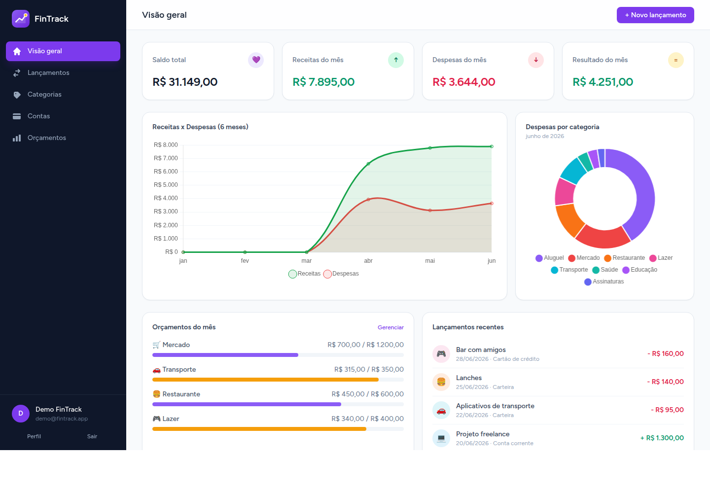
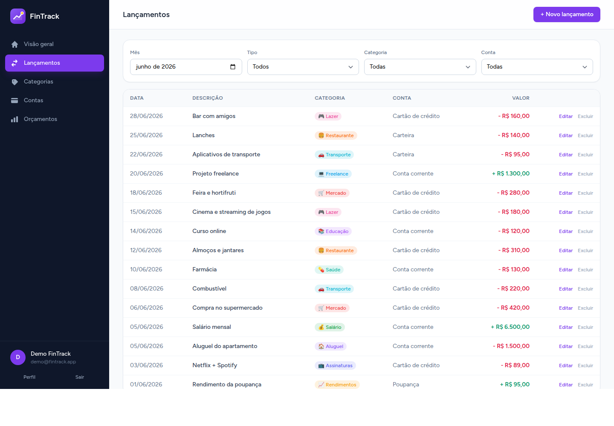

# FinTrack

> **Controle de finanças pessoais** — registre receitas e despesas, organize por categorias e contas, acompanhe orçamentos e veja para onde seu dinheiro vai, com **dashboard e gráficos**.

[](https://github.com/ReneMartins1983/FinTrack/actions/workflows/ci.yml)
[](https://fintrack-0g67.onrender.com)


🌐 **Demo ao vivo:** **<https://fintrack-0g67.onrender.com>** — `demo@fintrack.app` / `password`

> Roda no plano gratuito do Render: o primeiro acesso após inatividade pode levar ~30–50s para "acordar".

O FinTrack é um app full-stack de finanças pessoais construído com **Laravel 12** no
back-end e **Vue 3 + Inertia** no front-end (sem API separada — as páginas Vue recebem
os dados direto do controller). Layout com **sidebar** e identidade própria em violeta.

## 📸 Telas




## ✨ Funcionalidades

- 📊 **Dashboard**: saldo total, receitas/despesas/resultado do mês, evolução de 6 meses
  (gráfico de linha) e despesas por categoria (gráfico de rosca).
- 💸 **Lançamentos**: receitas e despesas com categoria, conta, data e descrição —
  CRUD em modal, com filtros por mês, tipo, categoria e conta.
- 🏷️ **Categorias**: por tipo (receita/despesa), com **cor e ícone** próprios.
- 💼 **Contas**: carteira, conta corrente, poupança e cartão — cada uma com **saldo atual**
  calculado a partir dos lançamentos.
- 🎯 **Orçamentos (opcional)**: limite mensal por categoria, com barra de progresso e
  alerta de estouro.
- 📥 **Importação de CSV**: importe extratos com **mapeamento de colunas** e **prévia**
  antes de confirmar (tipo inferido pelo sinal do valor).
- 🔐 Autenticação (Laravel Breeze) e dados **isolados por usuário**.
- 🧪 Testado (feature tests) e com **CI**.

## 🛠️ Stack

| Camada    | Tecnologia                                  |
| --------- | ------------------------------------------- |
| Back-end  | Laravel 12 · PHP 8.3                         |
| Front-end | **Vue 3 + Inertia 2** · Vite · Tailwind CSS |
| Gráficos  | Chart.js (vue-chartjs)                       |
| Auth      | Laravel Breeze                              |
| Banco     | MySQL 8.4 (SQLite na demo)                   |
| Ambiente  | Docker (PHP-FPM, Nginx, MySQL, Node 20)      |

## 🏗️ Arquitetura

- **Inertia** liga Laravel e Vue sem uma API REST separada: cada controller renderiza
  uma página Vue (`Inertia::render`) já com os dados (props).
- **Domínio**: `Account`, `Category`, `Transaction` e `Budget`, todos pertencentes a um
  `User` (escopo por usuário em todas as queries e verificação de posse nas escritas).
- **Saldo da conta** = saldo inicial + receitas − despesas.
- **Dashboard** agrega os dados no `DashboardController` (cards, série de 6 meses,
  despesas por categoria e progresso dos orçamentos).

### Estrutura do front-end (`resources/js/`)

| Caminho | Responsabilidade |
| --- | --- |
| `Layouts/AppLayout.vue` | Layout com **sidebar**, navegação e toast de feedback |
| `Pages/Dashboard.vue` | Cards + gráficos + orçamentos + recentes |
| `Pages/Transactions/Index.vue` | Lista com filtros e modal de CRUD |
| `Pages/Categories/Index.vue` | Categorias por tipo, com cor/ícone |
| `Pages/Accounts/Index.vue` | Contas com saldo atual |
| `Pages/Budgets/Index.vue` | Orçamentos mensais (opcional) |
| `Pages/Import/Index.vue` | Importação de CSV (parse, mapeamento e prévia) |
| `Components/Charts/*` | Wrappers de Chart.js (linha e rosca) |

## 🚀 Como rodar

Pré-requisitos: **Docker** e **Docker Compose**.

```bash
cp .env.example .env

# imagem + dependências
docker compose up -d --build
docker compose exec app composer install
docker compose exec app php artisan key:generate
docker compose exec app php artisan migrate --seed

# assets (Vue/Inertia/Vite)
docker compose run --rm node npm install
docker compose run --rm node npm run build
```

Acesse **http://localhost:8004** e entre com `demo@fintrack.app` / `password`.

Para desenvolvimento com hot-reload do Vite:

```bash
docker compose run --rm --service-ports node npm run dev
```

## 🧪 Testes

```bash
docker compose exec app php artisan test
```

## 📄 Licença

MIT.
